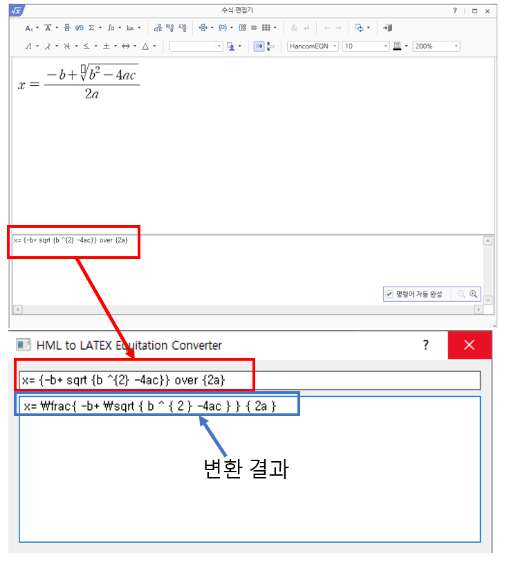

# HML-to-LATEX-equitation-converter

한글 수식 편집기의 명령어를 LATEX 수식 형태로 변환하는 HML 수식 변환기입니다.
원본 hml 변환 코드는 [여기](https://github.com/OpenBapul/hml-equation-parser)에서 확인 가능합니다.

## 다운로드
[여기](https://github.com/Hydragon516/HML-to-LATEX-equitation-converter/releases)에서 최신 버전의 hml2latex.exe를 다운받아 실행합니다.

## 사용방법
아래 그림을 참고하세요.

##업데이트
* 2021/07/16 - 최초 커밋
